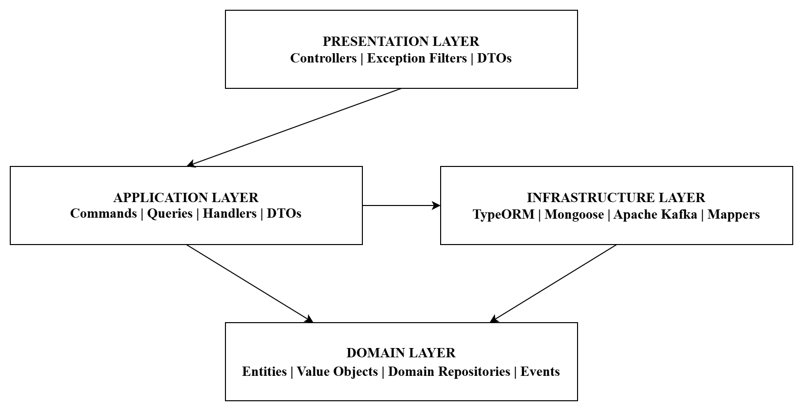

# Inventory Management System

> Built with **NestJS**, **Domain-Driven Design**, **Hexagonal Architecture**, **Event-Driven Architecture**, and **CQRS**.  
> Reference implementation of a client's work. MIT License. Open source.

[](https://github.com/akeematamuni/inventory-management-system/github/workflows/ci.yml)
[](https://opensource.org/licenses/MIT)

---

## Business Context

Company is an industrial PPE distributor operating two warehouses in Lagos and Warri, with 4,000+ SKUs.  
This system solves the problem of managing stocks via Excel spreadsheets and WhatsApp messages, monthly variances costing significantly, unplanned stockouts, and lack of reliable audit trail.

---

## Architecture Overview


**Key architectural decisions:**
- **DDD tactical patterns**: Entities, value objects, aggregates, domain events
- **Hexagonal architecture**: Domain has zero framework dependencies
- **CQRS**: Commands mutate state, queries read state, neither knows the other
- **Polyglot persistence**: PostgreSQL for transactional data, MongoDB for catalogue
- **Event-driven side effects**: Balance updates and alerts triggered by domain events
- **Immutable ledger**: Every stock movement is a permanent append-only record

---

## Tech Stack

| Concern | Technology | Reason |
|---|---|---|
| Framework | NestJS | Enterprise-grade, decorator-driven, DI container |
| Language | TypeScript (strict) | Type safety across all layers |
| Transactional DB | PostgreSQL + TypeORM | ACID guarantees for ledger and balance data |
| Document DB | MongoDB + Mongoose | Flexible schema for product catalogue |
| Event bus (default) | NestJS EventEmitter | Zero-config in-process events |
| Event bus (production) | Kafka | Persistent, replayable, cross-service events |
| CQRS | @nestjs/cqrs | Command/query separation at application layer |
| Monorepo | Nx | Library boundary enforcement |
| API docs | Swagger / OpenAPI | Auto-generated from decorators |

---

## Features

### Stock Operations
- **Purchase Orders**: PO-based stock receiving with partial receipt support
- **Stock Transfers**: Inter-warehouse transfers with dispatch/receive lifecycle
- **Adjustments**: Manual corrections with mandatory reason codes and audit trail
- **Cycle Counts**: Formal stocktake workflow with variance detection and approval

### Reporting
- **Stock Levels**: Current balance per product per warehouse
- **Movement History**: Full ledger with filters (date, type, product, warehouse)
- **Low Stock Alerts**: Automatic alerts when balance drops below reorder point
- **Inventory Valuation**: FIFO and AVCO cost calculations

### System
- **Immutable Ledger**: Append-only record of every stock movement, no updates

---

## Getting Started

### Prerequisites

- Node.js 20+ with pnpm installed
- Docker + Docker Compose

### 1. Clone and install

```bash
git clone https://github.com/akeematamuni/inventory-management-system.git
cd inventory-management-system
pnpm install
```

### 2. Configure environment

```bash
touch .env
# Edit .env with necessary values. Check env-setup.txt to see required values
```

### 3. Start infrastructure

```bash
docker-compose -f ./infra/prod.compose.yaml --profile core --profile kafka --profile monitoring up -d
# Starts: PostgreSQL, MongoDB, Redis, Kafka, Zookeeper, Kafka UI, Loki, Prometheus, and Grafana
```

### 4. Run migrations and seed databases

```bash
pnpm run migration:run
pnpm run seed
# Seeds databases with 2 warehouses, 8 products, users, opening stock, purchase orders, transfers, alerts, etc.
# Configured to be idempotent, safe to run multiple times.
```

### 5. Build and start application

```bash
pnpm run build
pnpm run start:dev
```

### 7. Open API documentation

```bash
http://localhost:8000/api/docs
# Remember to change port and global prefix accordingly
```

---

## Inventory Events Published

| Topic | Fired when |
|---|---|
| inventory.stock_received | Goods received against a PO |
| inventory.stock_transfer_dispatched | Transfer dispatched from source |
| inventory.stock_transfer_received | Transfer received at destination |
| inventory.adjustment_created | Manual stock adjustment made |
| inventory.cycle_count_approved | Cycle count approved |
| inventory.opening_stock_set | Opening stock seeded |

---

## Architecture Decision Records

| ADR | Decision |
|---|---|
| [ADR-01](docs/01-immutable-ledger.md) | Immutable append-only stock ledger |
| [ADR-02](docs/02-polyglot-persistence.md) | PostgreSQL + MongoDB polyglot persistence |
| [ADR-03](docs/03-hexagonal-architecture.md) | Hexagonal architecture with ports and adapters |
| [ADR-04](docs/04-event-driven-side-effects.md) | Event-driven balance updates and alerts |
| [ADR-05](docs/05-cqrs.md) | CQRS with @nestjs/cqrs |
| [ADR-06](docs/06-kafka-transport.md) | Kafka as optional event transport |

---

## License

MIT — see [LICENSE](LICENSE)

